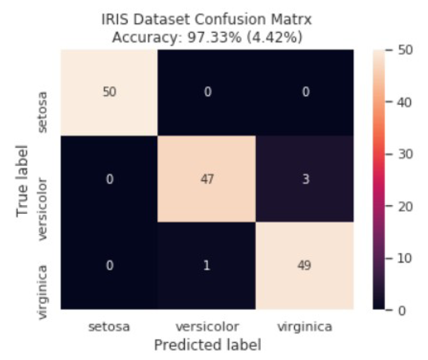
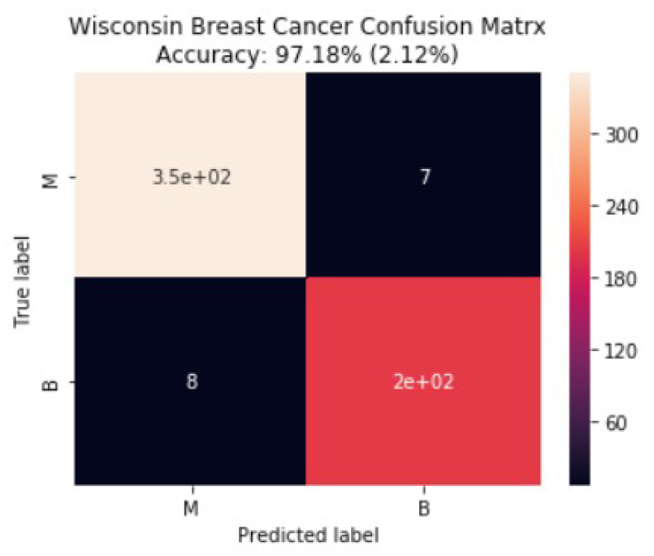
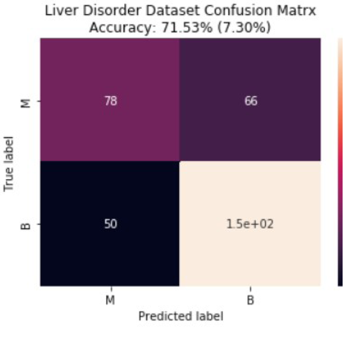

# MachineLearningProjects

## Classification on Different Databases Using Artificial Neural Network (ANN) and 10-Fold Cross-Validation

In this paper, the author introduces a classification approach using multilayer perceptron with the backpropagation learning algorithm. This paper presents a
comparative study on the performance of artificial neural networks on 3 different datasets. An artificial neural network with 10-fold cross validation was applied to **UCI datasets – Iris, Wisconsin breast cancer and BUPA liver disorder datasets**.

The performance measures **(accuracy,sensitivity and specificity)** were measured and the values obtained were compared to other studies on the same databases.
**97.33% , 97.38% and 71.53%** accuracies were obtained for Iris, Wisconsin breast cancer and BUPA liver disorder datasets respectively.

You can see the Confusion Matrixes below:

